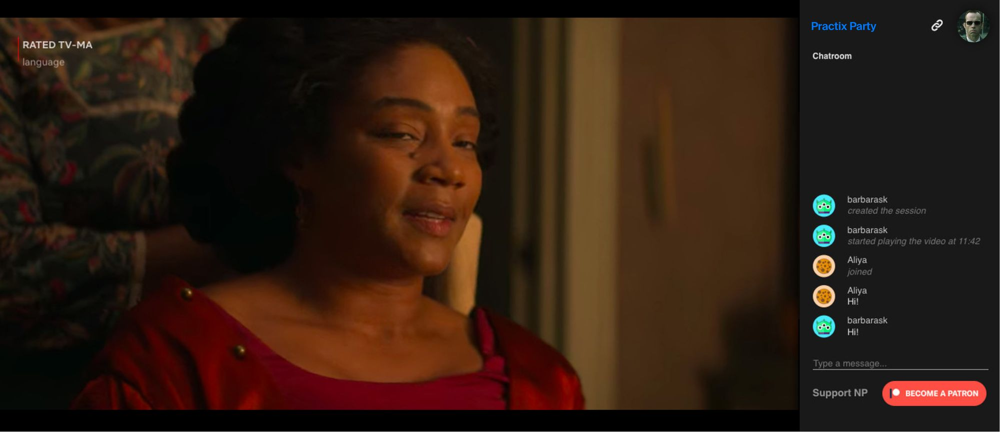
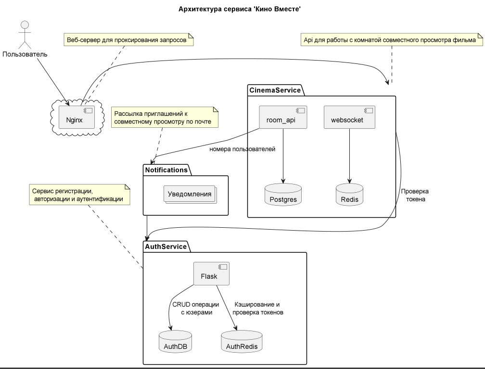
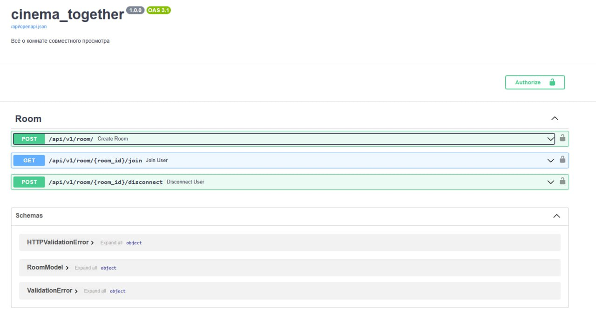

# Дипломная работа "Кино вместе"

## Предлагаемая идея проекта из задания
> Выполните проект «Кино вместе»: кнопка, проверяющая список «Хочу посмотреть» 
у друзей пользователя и выводящая совпадения. 
После чего начинается сеанс совместного просмотра с чатом. 
Также есть общий механизм управления (_пауза, перемотка_) контентом у всех.

## Реализованная схема
Предполагается, что создание списка друзей выходит за рамки данной работы, 
поскольку объем работы сопоставим или даже выше "остальной" части проекта.  
Таким образом, схематическая описание проекта следующее:  

### room api
**Зарегистрированный** пользователь (интегрируем **сервис аутентификации**) 
онлайн-кинотеатра создает общую комнату для просмотра фильма и получает на неё html-ссылку. 
  - Информация о созданной комнате, и о подключенных / отключенных к ней
  пользователях сохраняется в **postgres**.

### notifications
С учетом замечания выше, касающегося списка друзей, предполагается, 
что владельцу комнаты предлагается готовая подборка тех пользователей
среди друзей, которые пометили данный фильм тегом "Хочу посмотреть".  
  - рассылка приглашений к совместному просмотру производится путем подключения 
**сервиса нотификации** с реализованной схемой уведомления по электронной почте.  

Это однако, не мешает создателю комнаты просмотра отправить ссылку кому-то персонально.
Например, через соцсети.  
В настоящее время не реализована проверка подключения к общей комнате только лицам, 
которые присутствуют в уведомлении. 
Такая схема делает возможным передачу ссылки от друга к другу.  
Но у данного подхода есть свои плюсы с точки зрения **продуктового разработчика**:
- это и потенциальное увеличения круга друзей
- и возможная регистрация нового пользователя-клиента, воспользовавшегося ссылкой

### websocket  
Запуск фильма предполагается начать сразу после рассылки уведомлений-приглашений.
Однако, никто не мешает владельцу комнаты приостановить фильм, нажав на паузу
и дождаться кого-нибудь для начала совместного просмотра.  
По рекомендации наставника использовалась сторонняя библиотека **broadcaster**:
  - для реализации _совместного управления плейером_ и,
  - для _невербального чата_ в проекте.

Следует отметить, что в чате реализована **пагинация**
 

 

### front
Для демонстрации работы страницы с комнатой совместного просмотра, в настоящем проекте
добавлен прототип фронтенда с демонстрацией управления элементами плейера и чата.

###  redis
В целях восстановления информации по **_не закрытой_** комнате, вся информация о ней
сохраняется (кэшируется) в **Redis**:
- текущий тайминг, 
- работает плейер или на паузе,
- текущий состав участников, 
- именованная текстовка чата.

### auth
Сервис аутентификации и авторизации используется на разных стадиях проекта.
1. В текущей реализации к комнате совместного просмотра могут подключиться только
авторизованные пользователи онлайн-кинотеатра.
2. Для отправки уведомлений необходима дополнительная информация о пользователях

